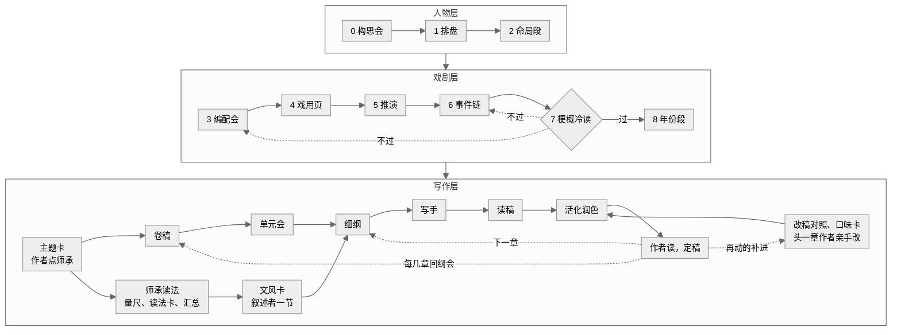

<h1 align="center">角色建造-八字法（bazi-writing）</h1>

<p align="center">
  <b>从一个人的真相长出一本书。</b>
</p>

<p align="center">
  <a href="#看看它的输出"><b>看看它的输出</b></a>
  &nbsp;·&nbsp;
  <a href="#三分钟上手"><b>三分钟上手</b></a>
  &nbsp;·&nbsp;
  <a href="#常见问题"><b>常见问题</b></a>
</p>

<p align="center">
  
  
  
  <a href="./LICENSE"></a>
</p>

用八字法给小说角色完整的人格和生平，轻松让小说角色像现实中的真人一样拥有一生，再从这些人身上长出故事。这是一个 Claude Code skill，写的是网文连载，第一目标是女频长篇。分三层：**人物层**给每个角色一生，**戏剧层**看这群人起化学反应，排出事件链，**写作层**把事件链排成卷、单元、章，一本期待账贯穿。人物层与戏剧层已经能用，写作层的模板、检查器与各环节的任务书已有，网文样例书在写。仍在更新中。

这是写作工具，仅作参考，不做命理咨询。

## 看看它的输出

下面是样例 [examples/沈砚](examples/沈砚) 的节选。作者只给了四柱（甲申 壬申 乙巳 戊寅，男，古代架空），没给任何描述；脚本排盘，模型照任务书写完。整份档案十六段、八十五条，每条都有命盘上的出处。

**一句话**

> 替人写了半辈子文书的读书人：六岁那夜看着差役把家当一样样写上抄家的单子，从此信只要有人托着就塌不下来；他这一生最难的一笔，是在纸上落下自己的名字。

**童年事件**：钉下他一辈子的那一夜

> 六岁那年（三〇六年），父亲在任上被卷进一桩案子。一天夜里差役进了官舍，照着一张单子把家当一样样点过、封存，连父亲书案上那方用了半辈子的砚台也写了进去；父亲在院子当中站得笔直，一直站到被带走。他记下的是那张单子：家里的每样东西，都落进了别人的字里。

**谎言**：他信的那条错道理，和它在日子里的样子

> 他信：只要有人肯托一把，塌下来的事总能熬过去；自己硬扛的人，才会被砸在底下。
>
> 日子里它长这样：每到该拍板的时候，他先去找人商量、找人作保，翻旧例、引上一辈的话，句子越说越长，结论越落越迟；有人肯在上头签字的事，他才动笔。

**年表与两难**：三十岁选错一回，四十五岁落了地

> 三十岁（三三〇年），两难：恩师被参，案子牵到他经手的文书。一头是站到恩师那边，替他写辩状、认下经手的每一封信，举人的功名和幕中的位置一起押上，像六岁那年站在院子里的父亲；一头是交出恩师早年叫他烧、他却留着的一封信，换自己干净出来，保住功名，也保住妻子带来的陪嫁田。他选了后一头，跟自己说是为了她的田。恩师发往边地，他每月托人送去银钱。
>
> 四十五岁（三四五年）：他用教书的束脩和剩下的一点钱，在城外买下一小块地，地契上是他自己的名字；同年把死在边地的父亲迁回来，葬在那块地上。坟前他站了很久，换了一回腿，又站住了。

**每一句都有出处**：作者本里，上面那条童年事件后面挂着命盘依据；读者本把编号剥掉，干支、十神、神煞一个字都不进，检查器兜底。

```text
六岁那年（三〇六年），父亲在任上被卷进一桩案子。……
｜溯源 L-6-庚寅-天克地冲年柱、L-6-庚寅-冲提纲、L-6-庚寅-域-名誉与是非、IM-忌-木
```

**同一张盘，换一个世界**：设定卡换成现代都市，八十五条的溯源编号一个不动，只换措辞（[沈砚.现代.读者本.md](examples/沈砚/人物/沈砚.现代.读者本.md)）。

| 古代架空 | 现代都市 |
|---|---|
| 替人写了半辈子文书的读书人 | 替领导写了半辈子材料的笔杆子 |
| 差役进了官舍，照着一张单子把家当一样样点过 | 检察院的人进了单位分的房子，照着一张清单把家里的东西一样样点过 |
| 举人功名、恩师幕中掌文书的位置、妻子带来的几十亩陪嫁田 | 考进的编制、老领导身边秘书的位置、岳父家陪送在妻子名下的那套房子 |

全文：[沈砚.读者本.md](examples/沈砚/人物/沈砚.读者本.md)（给人读的）、[沈砚.md](examples/沈砚/人物/沈砚.md)（作者本，带溯源编号）。

## 三分钟上手

需要 Python 3 与 Node.js。

```bash
git clone https://github.com/DRMCT/bazi-writing ~/.claude/skills/bazi-writing
cd ~/.claude/skills/bazi-writing
python -m venv .venv
.venv/Scripts/pip install -r requirements.txt
```

macOS 与 Linux 把 `.venv/Scripts/` 换成 `.venv/bin/`，下同。

装好后在 Claude Code 里输入 `/bazi-writing`，或者直接说：

```text
用八字捏人：男，古代架空，四柱 甲申 壬申 乙巳 戊寅
```

```text
反推一个角色：女主，外表温和、心里很硬，二十五岁前后家里出事
```

```text
用八字开书：民国，一家绸缎庄的三代人
```

只要一个人就停在人物档案；要开书就照下面十步走，每一步要作者拍板的地方它会停下来问。

## 怎么走

一句话：先给每个人一生，再看这群人起什么化学反应，最后写成书。

十步：第 0 到 8 步排人排事，第 9 步写书。开书时作者点师承，师承读法与卷稿并行，第一份细纲之前做完。实线是往前走，虚线是往回走：梗概冷读是闸，不过不往下写；写章是回路，定稿回到下一章的细纲，每几章开回纲会，正文里长出来的东西写回卷稿；开书头一章作者亲手改，整理成改稿对照与口味卡，活化润色照它改后面的章，作者再动的地方补回去。



## 人物层能做什么

**正推**。给一个角色的生日或八字四柱，脚本排盘，模型据此写人物档案：主题命题、性格表里、童年事件、谎言与秘密、需要与想要、抵抗线、亲密关系模式、说话方式、能力与漏洞、他人眼中的他、年表与两难。再按大运分阶段写状态卡：这十年他的性格、喜好、价值观、说话方式、亲密关系、手里有什么与画像差在哪，二十五岁和三十七岁不是同一个人。命局定的只写一次，随大运变的只留底色和一句走向，逐步的偏移都在卡里，两边不打架。

**情绪过程**。写一场戏要的是这个人此刻哪根线被碰到、身体先怎么动、拿什么盖住、什么时候盖不住、余波拖到哪；开书时它写在每个人的戏用页上。档案里没有口头禅和标志动作：卡上只要有一句可搬的话、一个可搬的动作，模型就会每章搬一回；认人靠说话的方式、选择和别人怎么对他。

**溯源与去术语**。每条特质带溯源编号，指向命盘上的具体事实，没有依据的特质不写。八字本身不进正文：读者本里不出现干支、十神、神煞，有检查器兜底。

**题材不限**。档案顶层有一张设定卡，把权力、上一辈、结合、伴侣那边的人、体面的路、家底各落在这个世界的什么位置上，规则表只说功能位，模型按设定卡落词。古代宅斗、民国、现代都市、架空都行，同一张盘换一个世界，溯源编号一个不动，只换措辞。

**反推**。先写下想要什么样的角色（身强身弱、格局、某个十神显不显、故事里二十四到四十六岁走正弧、三十岁前后出事、与另一个角色是什么关系），脚本在全部命盘里找出最合的几个。

**群像**。几个角色放在一起，脚本算出彼此的关系边、大运的顺逆与同步，逐年列出每个人被引动的事和领域，排出配角各自的日程和交汇年份，再推出每个人没人插手时照常会落到哪里（默认下场）、开书之前的旧账（前史）、每个热年的事件卡（谁在场、各押了什么、各往哪边动、旧账），长跨度的书另给按主角大运切的大纲投影。

样例：[examples/沈砚](examples/沈砚)（正推；`人物/沈砚.现代.json` 是同一张盘换成现代都市的对照）、[examples/林昭](examples/林昭)（反推选盘，与沈砚有关系边、年表、两难与日程，三人的群像推演）、[examples/对照实验](examples/对照实验)（换盘测试的对照组，差异度报告在 `references/校核/换盘_对照报告.md`）。

**进阶玩法**（反推与群像推演都已能用）：

1. **提供创作灵感**：把你用八字法建造的人物放进喜欢的小说里，推算出 ta 与小说世界里的人和事如何相互反应。书里原有的人物，可以按性格反推出命盘。
2. **“赛博”游玩小说世界**：用自己的八字创造一个“平行世界的自己”，把 ta 放进小说世界里，达到“赛博游玩”的效果。

## 戏剧层：先有一件值得写的事

排盘之前先开构思会：三个起草者各写一个盘子，作者挑，读者从头等到尾的那一刻（主期待）在这里定。排完盘开编配会：全书一问、主脑、时间尺度、每对人之间横着什么、谁碎、透哪几条默认下场、开篇三章落在哪。盘在网文里给得最多的是书外的时间：默认下场先透给读者再去改，前史是追上来的旧账；书里的热年只是事的一种来路，对手出招、家人出招、得知与认出、钟上的日子都是。每个人一页戏用页：他要什么、谁挡着、怎么去要、什么时候盖不住；写完两两交给没读过书的代理做对手戏测试，看关在一间屋里撞不撞得起来。推演脚本出事件卡，模型写事件链，先立每卷的骨再填热年；讲成梗概，交给一个什么都没读过的代理冷读，读不下去就回去改。

## 写作层：网文连载

市面上的写作套装大都从市场出发：题材从榜单来，结构从对标作品拆出来，一次对话排完全书，之后写手照着写。我们在一套现有套装上实测过，人物再特别，也会被对标的模子浇成榜单的平均形状。所以写作层自己做，重心在人物，也在读者追什么：

- 计划是回路不是阶段。卷只排到单元，单元一次一个开会，模型给三个走法作者选；细纲一章一议，不给台词；每写几章开一次回纲会，正文里长出来的东西写回计划。
- 一本期待账贯穿：读者在等什么、这一章开了、压了、推了、兑现了还是落空了；兑现那一回写足，旁人的反应由近到远；章尾停在哪一种上，一半的章可以不留钩，钩交给下一章。账从这本书自己的线与知情差里长，不从榜单与公式来；检查器只管账，不定每几章一回兑现。
- 期待账的规矩与阈值，是拿六本作者认可的女频长篇（两千六百多章）逐章记账量出来的：知情差是每本书的发动机，期待分尺度，兑现以后的反应层比兑现本身还长，连着松几章并不拖、只要有笑、有甜、有推。
- 师承：作者点一两本认可的同类网文，逐章读成读法卡，学它怎么讲、怎么断章、怎么写兑现，不借句子与题材。
- 规矩教不会人活不活：开书头一章作者亲手改，整理成改稿对照与口味卡，活化润色代理照它改后面的章，作者再动的补回去。
- 写手一页纸，写手与读稿分开；靠人眼发现过的坑都变成机器检查：引号照抄、句尾否定、跨章重复、伏笔物件次数、术语、期待账。

设计与来由见 [DESIGN-写作层.md](DESIGN-写作层.md)。

## 和别的写作套装搭配

人物档案格式中立，可以导给别的套装写正文。`scripts/export_story.py` 把档案导成 [oh-story](https://github.com/zenstory-ai/oh-story-claudecode) 项目的 `设定/角色/{角色}.md` 与 `设定/关系.md`（长篇）或 `设定.md` 里的一段（短篇），样例见 `examples/林昭/导出/`。导出本天然过去术语检查；卡上的口头禅一栏填的是指路（腔调见语言风格档案，身体反应见情绪过程），不给可搬的句子。本 skill 不依赖任何写作套装，单独也能用；人物档案"字段在场、值可以待补充"的写法借自 oh-story。

## 常见问题

**要懂八字吗？** 不用。排盘与查表全由脚本完成，你读到的档案是人话；想核对某句话从哪来，作者本里每条都挂着编号。

**八字会写进小说吗？** 不会。干支、十神、神煞只在作者本里，读者本、导出本与正文都由检查器拦。

**这是算命吗？** 不是。命盘在这里是给角色的生成规则，不是给真人的判断；不做命理咨询。

**只想捏一个人、不写书，行吗？** 行。排盘、写命局段、再写他自己的年份段，就是一份完整的人物档案，上面的沈砚就是这么来的。

**能和 oh-story 一起用吗？** 能，见上一节。

**规则准不准、从哪来？** 有古籍依据的表逐条对照古籍校核，自起草的部分都标明了，见下一节。

## 规则从哪来

排盘与查表全由脚本完成，模型只做解读。有古籍依据的表逐条对照古籍校核，一条规则一张卡，放在 [references/校核](references/校核)；机器表 `scripts/bazi_core/tables/` 的每条都带卡号。

| 表               | 校核依据                 |
| --------------- | -------------------- |
| 调候用神            | 《穷通宝鉴评注》，余春台辑，徐乐吾评注  |
| 神煞、刑冲合害、十二长生、纳音 | 《三命通会》，万民英撰，四库本      |
| 格局成败救应          | 《子平真诠评注》，沈孝瞻原著，徐乐吾评注 |
| 十神性格、五行体质气质、六亲宫位与童年、岁运事件类型的古籍锚点 | 《滴天髓阐微》，刘基原注，任铁樵增注 |
| 五运六气盘面与体质表的古籍锚点 | 《素问》运气七篇（天元纪至至真要），维基文库录入本；盘面与年关系的判法搬自作者自己的排盘项目；合看的主次（年主干、运为体、纲气为主、当步为用）据六元正纪六十年纪与五运行"上下相遘"；画像层只给体格体感与薄弱处，民病全走疾病与情志候选（事件层，默认不写） |

卡上注明所用版本与页码，可对原书核查。仓库不附古籍全文：校核用的校对本转录自今人整理本，标点校勘和注释属于整理者，不随本仓库发布。校核流水线（OCR、打标、抽卡）的脚本在 `scripts/`，要自备古籍扫描件，依赖见各脚本的文档串。

旺衰打分与用神判定是自起草的确定性算法，没有古籍逐条依据，按徐评例盘与子代理独立判定两路校准，见 DESIGN-命盘层 2.4、2.5。弧光打分、反推搜索、神煞叙事标签与去术语词表也是自起草；叙事表的译法栏写功能位不写机构（上一辈、伴侣那边的人、家底），古籍判词栏照录，题材落词交给设定卡（DESIGN-人物层 5）；十神性格、五行体质气质、六亲宫位与童年、岁运事件类型、日支亲密关系、谎言候选、弧光匹配、意象系统、五运六气体质九张叙事表里的叙事映射是自起草，只有锚点栏指向古籍校核卡；运气七篇论的是岁气与民病，以生年运气推人的底子是后世引申，表上写明。

## 安装与测试细节

脚本在 Python 3.14 上开发和测试；运行期只用标准库，外加 Windows 上 zoneinfo 需要的 tzdata。检查器是纯 Node 脚本，没有 npm 依赖。

用法见 [SKILL.md](SKILL.md)，总纲见 [DESIGN.md](DESIGN.md)，命盘层与人物层的设计见 [DESIGN-命盘层.md](DESIGN-命盘层.md)、[DESIGN-人物层.md](DESIGN-人物层.md)，戏剧层的设计见 [DESIGN-戏剧层.md](DESIGN-戏剧层.md)，写作层（网文）的设计见 [DESIGN-写作层.md](DESIGN-写作层.md)。

```bash
.venv/Scripts/pip install -r requirements-dev.txt
.venv/Scripts/python -m pytest scripts
node scripts/check-character.js examples/沈砚/人物/沈砚.json
.venv/Scripts/python scripts/check_divergence.py examples/沈砚/人物/沈砚.json examples/林昭/人物/林昭.json --threshold --summary
```

## 第三方代码

- `scripts/bazi_core/vendor/`：节录自 [qianye-wuyu/yueyuan-bazi](https://github.com/qianye-wuyu/yueyuan-bazi)，MIT，许可证见同目录的 `LICENSE.yueyuan-bazi`。
- 测试用 [tyme4py](https://github.com/6tail/tyme4py)（MIT）交叉校验四柱与大运。

## 致谢

 [@BingBingChangChang](https://github.com/BingBingChangChang) 提供灵感，我负责搭建、实现。

## 许可证

代码与自撰内容按 MIT 许可，见 [LICENSE](LICENSE)。卡片与测试夹具里引用的古籍原文和徐乐吾评注不属于本仓库的许可范围。
