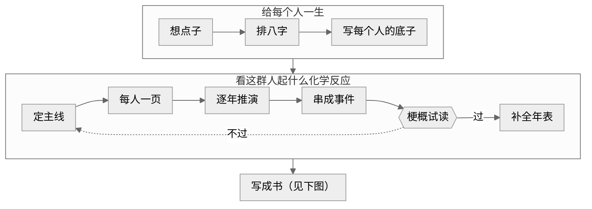
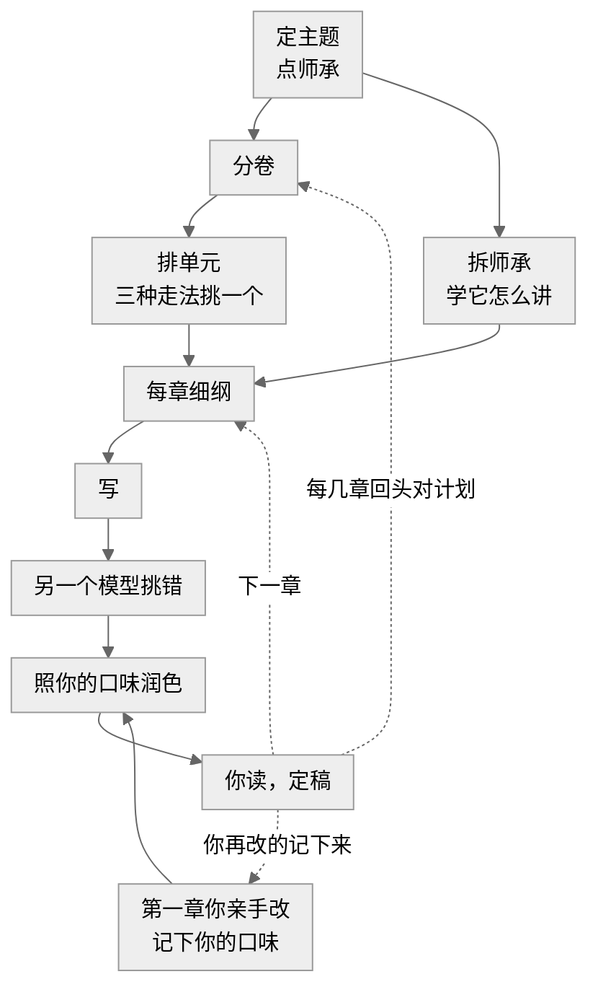

<h1 align="center">角色建造-八字法（bazi-writing）</h1>

<p align="center">
  <b>从一个人的真相长出一本书。</b>
</p>

<p align="center">
  <a href="#看看它的输出"><b>看看它的输出</b></a>
  &nbsp;·&nbsp;
  <a href="#三分钟上手"><b>三分钟上手</b></a>
  &nbsp;·&nbsp;
  <a href="#常见问题"><b>常见问题</b></a>
</p>

<p align="center">
  
  
  
  <a href="./LICENSE"></a>
</p>

用八字法给小说角色完整的人格和生平，轻松让小说角色像现实中的真人一样拥有一生，再从这些人身上长出故事。

这是一个 Claude Code skill，写的是网文连载，眼下以女频长篇为主。它分三步：先给每个角色一生，再看这群人放在一起会起什么化学反应，最后把这些事写成一章一章的小说。前两步已经能用；写小说这一步还在拿一本样例书边写边改。

这是写作工具，仅作参考，不做命理咨询。

## 看看它的输出

下面是样例 [沈砚](examples/沈砚) 的节选。作者只给了一个八字（男，古代架空），一句描述都没给，下面这些都是它写出来的。

**一句话**

> 替人写了半辈子文书的读书人：六岁那夜看着差役把家当一样样写上抄家的单子，从此信只要有人托着就塌不下来；他这一生最难的一笔，是在纸上落下自己的名字。

**童年**：钉下他一辈子的那一夜

> 六岁那年（三〇六年），父亲在任上被卷进一桩案子。一天夜里差役进了官舍，照着一张单子把家当一样样点过、封存，连父亲书案上那方用了半辈子的砚台也写了进去；父亲在院子当中站得笔直，一直站到被带走。他记下的是那张单子：家里的每样东西，都落进了别人的字里。

**他信错的那句话**，和它在日子里的样子

> 他信：只要有人肯托一把，塌下来的事总能熬过去；自己硬扛的人，才会被砸在底下。
>
> 日子里它长这样：每到该拍板的时候，他先去找人商量、找人作保，翻旧例、引上一辈的话，句子越说越长，结论越落越迟；有人肯在上头签字的事，他才动笔。

**人生的两个关口**：三十岁选错一回，四十五岁落了地

> 三十岁（三三〇年），两难：恩师被参，案子牵到他经手的文书。一头是站到恩师那边，替他写辩状、认下经手的每一封信，举人的功名和幕中的位置一起押上，像六岁那年站在院子里的父亲；一头是交出恩师早年叫他烧、他却留着的一封信，换自己干净出来，保住功名，也保住妻子带来的陪嫁田。他选了后一头，跟自己说是为了她的田。恩师发往边地，他每月托人送去银钱。
>
> 四十五岁（三四五年）：他用教书的束脩和剩下的一点钱，在城外买下一小块地，地契上是他自己的名字；同年把死在边地的父亲迁回来，葬在那块地上。坟前他站了很久，换了一回腿，又站住了。

**每句话都有出处**：给作者看的那一版里，每条后面都挂着它在命盘上的依据；给读者看的那一版把这些全拿掉，八字一个字都不进小说。

**同一张盘，换一个世界**：把背景换成现代都市，人还是那个人，只是换了说法（[现代版全文](examples/沈砚/人物/沈砚.现代.读者本.md)）。

| 古代架空 | 现代都市 |
|---|---|
| 替人写了半辈子文书的读书人 | 替领导写了半辈子材料的笔杆子 |
| 差役进了官舍，照着一张单子把家当一样样点过 | 检察院的人进了单位分的房子，照着一张清单把家里的东西一样样点过 |
| 举人功名、恩师幕中掌文书的位置、妻子带来的几十亩陪嫁田 | 考进的编制、老领导身边秘书的位置、岳父家陪送在妻子名下的那套房子 |

全文：[给读者看的版本](examples/沈砚/人物/沈砚.读者本.md)、[给作者看的版本](examples/沈砚/人物/沈砚.md)。另一个样例 [林昭](examples/林昭) 是反过来的：先说想要什么样的人，再找合适的八字，还演示了三个人放在一起怎么推演。

## 三分钟上手

需要 Python 3 与 Node.js。

```bash
git clone https://github.com/DRMCT/bazi-writing ~/.claude/skills/bazi-writing
cd ~/.claude/skills/bazi-writing
python -m venv .venv
.venv/Scripts/pip install -r requirements.txt
```

macOS 与 Linux 把 `.venv/Scripts/` 换成 `.venv/bin/`。

装好后在 Claude Code 里输入 `/bazi-writing`，或者直接说：

```text
用八字捏人：男，古代架空，四柱 甲申 壬申 乙巳 戊寅
```

```text
反推一个角色：女主，外表温和、心里很硬，二十五岁前后家里出事
```

```text
用八字开书：民国，一家绸缎庄的三代人
```

只要一个人，它写完这个人就停；要开书，它会一步步往下走，每到要你拿主意的地方停下来问你。

### 开书时它会问你这几件事

拿不准的可以先说不知道，它会出几个让你挑。

- **种子**：你想写个什么故事，一句话也行：题材、主角是个什么样的人、轻松还是沉重。
- **设定卡**：故事放在什么年代、什么世界；在这个世界里，管事的是谁、长辈是谁、成亲是怎么回事、什么算体面的出路。同一个人放进古代和现代，说法不一样，靠它来换。
- **时辰准不准**：给真实生日时，只知道日子、不知道几点也没关系，告诉它就行。
- **目标读者**：写给谁看，比如爱看宅斗的女频读者。
- **主期待**：读者从头等到尾的那一刻，比如真相大白、当众翻身的那一天。
- **命题**：全书在问的那一个问题，比如为了家，该不该放下自己想要的。
- **乐子**：这本书好看好玩在哪：笑从哪来，主角最爱干什么。
- **叙述结构**：从头往后讲，还是现在和过去两条线交替讲，还是先给结局再倒回去。
- **师承**：一两本你喜欢、想让自己的书读起来像它的同类网文，文本你自己准备（epub 或 txt）。

写的过程中它还会请你拍几回板：三种走法挑一个、每章细纲过目、第一章亲手改一遍。别的事（用哪个模型、要不要检查）它自己办，事后告诉你。

## 它是怎么干活的

一句话：先给每个人一生，再看这群人起什么化学反应，最后写成书。



**第一步，给每个人一生。** 你给生日或八字；也可以只说想要什么样的人，它反过来找合适的八字。它排好盘，写出这个人的性格、童年、心里信错的那句话、真正想要的东西、怎么谈感情、怎么说话，还有每过十年他变成什么样。古代、民国、现代、架空都行。

**第二步，看这群人起什么化学反应。** 先和你一起想点子：三个模型各出一个方向，你挑。再定下谁是主线、谁和谁之间横着什么。每个人写一页：他要什么、谁挡着他、他怎么去争、什么时候绷不住。然后按每个人的命盘一年一年往下推，看哪一年谁出事、撞上谁，串成一条事件链，讲成一页梗概，交给一个什么都没看过的模型试读。读不下去就回头改。

**第三步，写成小说。**



- 点师承：开书时它会问你"师承是哪本"，就是请你点一两本喜欢、想让自己的书读起来像它的同类网文，文本你自己准备（epub 或 txt）。它一章一章拆开，学人家怎么讲故事、怎么断章、高潮怎么写，不抄句子。
- 先分卷，再一段一段排；每一段给你三种走法挑；每章先出细纲，你看过了再写。
- 一个模型写，另一个模型挑错。第一章你亲手改一遍，它把你改的地方记成你的口味，后面的章照着改；你再动哪里，它再记下来。
- 一路记着读者在等什么、等的东西来没来；每写几章回头对一下计划，正文里长出来的新东西写回去。

我们没有照市面上常见的做法，从排行榜和爆款套路出发：那样写出来的人物再特别，也会被磨成榜单上的平均样子。这里从人物出发，也从读者在追什么出发。

**进阶玩法**：

1. **提供创作灵感**：把你用八字法建造的人物放进喜欢的小说里，推算出 ta 与小说世界里的人和事如何相互反应。书里原有的人物，可以按性格反推出命盘。
2. **“赛博”游玩小说世界**：用自己的八字创造一个“平行世界的自己”，把 ta 放进小说世界里，达到“赛博游玩”的效果。

## 常见问题

**要懂八字吗？** 不用。排盘查表都由脚本做，你读到的是人话；想知道某句话从哪来，给作者看的那一版里每条都有出处。

**八字会写进小说吗？** 不会。干支、十神、神煞只留在给作者看的那一版，写进小说之前有检查器拦着。

**这是算命吗？** 不是。命盘在这里是给虚构角色的生成规则，不是给真人的判断。

**只想捏一个人、不写书，行吗？** 行，上面的沈砚就是这么来的。

**师承是抄吗？为什么要有师承？** 不是抄。很多作家心里都有一本自己觉得写得最好的书，自己写出来的东西也会带着它的影子：讲故事的口气、一章停在哪儿、高潮怎么铺、旁人怎么接话。师承就是把这层影子摆到明面上：你点一两本，它拆开学的是这些讲法，不借句子，也不借情节和人物；写出来的每一章还会拿去和师承原文比对，连着八个字以上一样的就报出来改掉。不给它一本书学，模型会照它自己默认的讲法写，四平八稳，一拍接一拍，读着像流水账；给了师承，它才知道你要的是哪一种好看。师承文本只放在你自己的书的项目里。

**能和别的写作工具一起用吗？** 能。人物档案可以导出给 [oh-story](https://github.com/zenstory-ai/oh-story-claudecode) 用，样例在 `examples/林昭/导出/`；不导出也能单独用。

**规则准不准、从哪来？** 见下一节。

## 规则从哪来

排盘与查表全由脚本完成，模型只负责把结果写成人话。有古籍依据的规则逐条对照原书校核过，依据是《穷通宝鉴》《三命通会》《子平真诠》《滴天髓》与《素问》运气七篇，一条规则一张卡，注明版本与页码，放在 [references/校核](references/校核)。没有古籍依据、是我们自己定的部分（比如身强身弱的打分、八字怎么翻译成性格和事件），都在表上标明了。仓库不附古籍全文。

想看设计的来龙去脉，从 [DESIGN.md](DESIGN.md) 开始；skill 本身怎么跑，看 [SKILL.md](SKILL.md)。

## 致谢

 [@BingBingChangChang](https://github.com/BingBingChangChang) 提供灵感，我负责搭建、实现。

排盘代码节录自 [qianye-wuyu/yueyuan-bazi](https://github.com/qianye-wuyu/yueyuan-bazi)（MIT，许可证见 `scripts/bazi_core/vendor/`），测试用 [tyme4py](https://github.com/6tail/tyme4py)（MIT）交叉校验。

## 许可证

代码与自撰内容按 MIT 许可，见 [LICENSE](LICENSE)。卡片与测试夹具里引用的古籍原文和徐乐吾评注不属于本仓库的许可范围。
